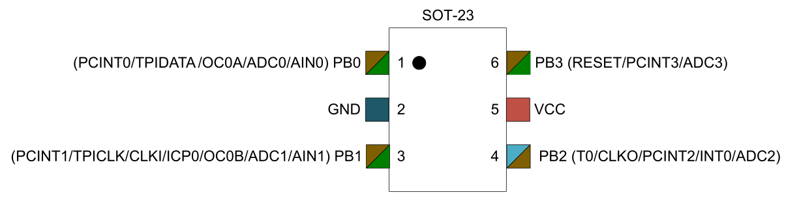

# Attiny10 

-----

## Flashing 

	MOSI --> TPIDATA  (PB0)
	MISO --> TPIDATA  (PB0)
	SCK  --> CLK	  (PB1)
	RST  --> RESET    (PB3)
	VCC  --> VCC
    GND  --> GND

## USBASP
 
Latest **usbasp** firmware that supports TPI:   

[https://www.fischl.de/usbasp/](https://www.fischl.de/usbasp/)

Together with latest **avrdude** that supports TPI:

[http://download.savannah.gnu.org/releases/avrdude/](http://download.savannah.gnu.org/releases/avrdude/)

Or you may find precompiled avrdude in **Arduino**:  

	/Path to Arduino/hardware/tools/avr/bin 

## Contact

Author：Wu Han  
Homepage：http://wuhanstudio.cc  
Contact：https://github.com/wuhanstudio/attiny10-example/issues
